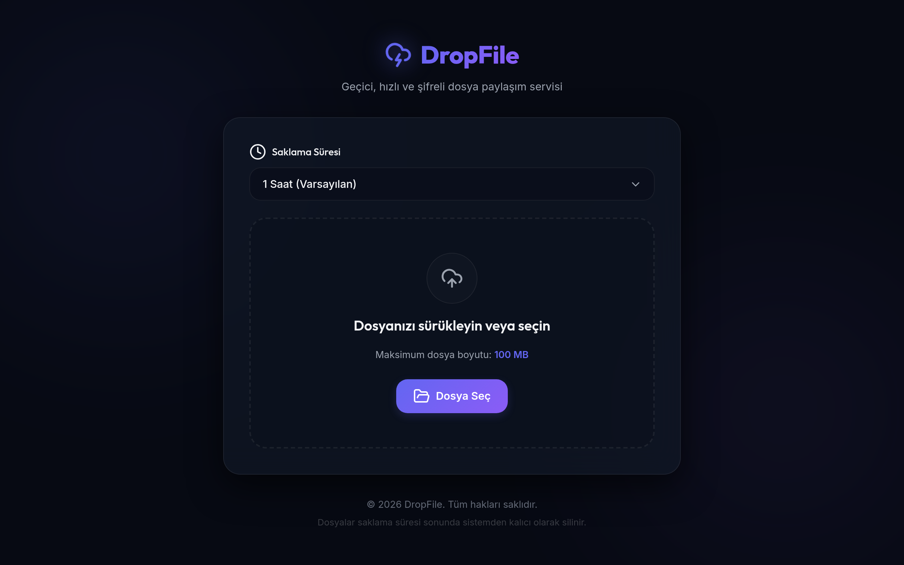

# DropFile - Geçici Dosya Paylaşım Platformu



DropFile, dosyalarınızı hızlı, güvenli ve geçici olarak paylaşmanızı sağlayan, modern tasarıma sahip bir web uygulamasıdır. Arka planda [tmpfiles.org](https://tmpfiles.org) altyapısını kullanarak doğrudan tarayıcı üzerinden dosya yüklemesi yapar. Böylece sunucunuzda hiçbir dosya barındırılmaz, depolama ve bant genişliği harcanmaz.

## Özellikler

- 🚀 **Sıfır Sunucu Yükü:** Dosyalar doğrudan istemci (tarayıcı) üzerinden tmpfiles.org sunucularına yüklenir.
- 📱 **Mobil Uyumlu Modern Arayüz:** Karanlık tema (Dark Mode) ve glassmorphism detaylarıyla premium bir kullanıcı deneyimi sunar.
- ⚡ **Sıfır Bağımlılık (Zero-Dependency):** Arka plandaki Node.js sunucusu tamamen yerleşik modüller (`http`, `fs`) ile çalışır. Dışarıdan hiçbir npm paketi (Express vb.) gerektirmez.
- ⏱️ **Özelleştirilebilir Saklama Süresi:** Dosyalarınızın 1 saatten 48 saate kadar ne kadar süreyle saklanacağını seçebilirsiniz.
- 🔗 **Doğrudan İndirme:** Yükleme tamamlandığında doğrudan dosyayı indiren bir bağlantı (Direct Link) sağlar.
- 📷 **QR Kod Üretimi:** Paylaşılan dosyayı mobil cihazlara hızlıca aktarabilmek için anında dinamik QR kod oluşturur.

## Kurulum ve Çalıştırma

Proje, çok hafif bir `node:alpine` Docker imajı üzerinde çalışacak şekilde yapılandırılmıştır.

### Gereksinimler
- Docker
- Docker Compose

### Adımlar

1. Proje dizininde bir terminal açın.
2. Aşağıdaki komut ile Docker konteynerini derleyip arka planda başlatın:
   ```bash
   docker compose up --build -d
   ```
3. Tarayıcınızda [http://localhost:9392](http://localhost:9392) adresine giderek uygulamayı kullanmaya başlayabilirsiniz.
   *(Eğer sunucu üzerinde çalıştırıyorsanız sunucunuzun IP adresini ve 9392 portunu kullanın).*

## Proje Yapısı

```text
.
├── Dockerfile             # Node.js Alpine tabanlı çok hafif imaj yapılandırması
├── docker-compose.yml     # Konteyneri 9392 portu ile dışa açan yapılandırma
├── server.js              # Statik dosyaları sunan yerel Node.js web sunucusu
└── public/                # İstemci tarafı (Frontend) dosyaları
    ├── index.html         # Ana sayfa ve sayfa iskeleti
    ├── favicon.svg        # Marka ikonu (Geometrik "D" Logosu)
    ├── css/style.css      # Özelleştirilmiş dark-theme arayüz tasarımları
    └── js/app.js          # Yükleme API entegrasyonu, ilerleme çubuğu ve QR kod algoritmaları
```

## Güvenlik Altyapısı

- Sunucu tarafında, dizin dışına çıkma (Directory Traversal) saldırılarını engellemek için özel yol normalizasyonu sağlanmıştır.
- Tarayıcı güvenliği için güçlü HTTP header'ları (`X-Content-Type-Options: nosniff`, `X-Frame-Options: DENY`, vb.) tanımlanmıştır.
- Hiçbir üçüncü parti Node.js bağımlılığı (npm modülü) kullanılmadığı için potansiyel paket açıklarına ve tedarik zinciri (supply chain) saldırılarına karşı maksimum koruma sağlar.

## Yasal Uyarı / Bilgilendirme

Bu proje yüklenen dosyaları [tmpfiles.org](https://tmpfiles.org) genel hizmeti üzerinde geçici olarak barındırır. Kişisel ve hassas verileri yüklemeden önce bu durumu ve ilgili platformun kullanım koşullarını göz önünde bulundurunuz.
